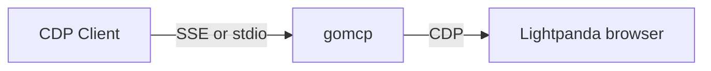

# Lightpanda Go MCP server

`gomcp` is a [MCP server](https://modelcontextprotocol.io) written in
[Go](https://go.dev/).

It exposes tools to interact with [Lightpanda Browser](https://lightpanda.io/)
via [CDP protocol](https://chromedevtools.github.io/devtools-protocol/).



## Installation

### Requirements

`gomcp` expects you installed [Lightpanda
Browser](https://lightpanda.io/docs/getting-started/installation).

### Build from sources

You need to install [Go](https://go.dev/doc/install) to build from source.

Once you cloned the repository, build the binary with `go build`.

## Usage

:warning: `gomcp` requires you first start Lightpanda Browser manually.

We recommand to change the default timeout to a longer value, like 180 seconds.
Indeed, interactions with a LLM can takes time reasonning and the default
timeout will drop the connection to early.

```
$ lightpanda --timeout 180
```

By defaut Lightpanda listen on `127.0.0.1:9222`. You can configure the port
number with the `--port` option.
In this case, use the `--cdp` option of `gocmp` to configure the browser's
address accordingly.

###  Configure Claude Desktop

You can configure `gomcp` as a source for your [Claude
Desktop](https://claude.ai/download).

Claude Desktop uses the
[stdio](https://modelcontextprotocol.io/docs/concepts/transports#standard-input%2Foutput-stdio)
transport to connect to a MCP server.

Edit the `claude_desktop_config.json` configuration file and add `gomcp` as mcp
server **and restart Claude Desktop**.

```json
{
  "mcpServers": {
    "lightpanda": {
      "command": "/path/to/gomcp",
      "args": ["-stdio"]
    }
  }
}
```

The model context protocol website gives a way to find
[claude_desktop_config.json](https://modelcontextprotocol.io/quickstart/user#2-add-the-filesystem-mcp-server)
file.

### Standard input/output (stdio)

You can start `gomcp` as a
[stdio](https://modelcontextprotocol.io/docs/concepts/transports#standard-input%2Foutput-stdio).

```
$ ./gomcp -stdio
```

### Server-Sent Events (SSE)

You can start `gomcp` as a
[SSE](https://modelcontextprotocol.io/docs/concepts/transports#server-sent-events-sse).

By default, the server will listen HTTP connection on `127.0.0.1:8081`

```
$ ./gomcp
2025/05/06 14:37:13 INFO server listening addr=127.0.0.1:8081
```

# Thanks

`gomcp` is built thanks of open source projects, in particular:
* [Go language](https://go.dev)
* [Chromedp](https://github.com/chromedp/chromedp)
* [JohannesKaufmann/html-to-markdown](github.com/JohannesKaufmann/html-to-markdown)
* [Lightpanda Browser](https://github.com/lightpanda-io/browser)
